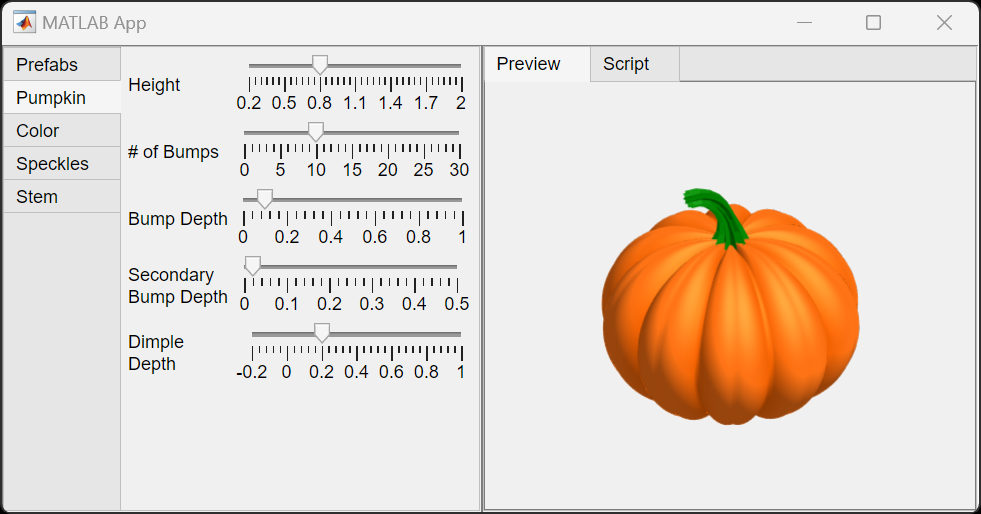

# Pumpkin Designer

 (For best results, open in MATLAB Online using a desktop computer or laptop)

A simple app for interactively designing pumpkins.  Share your pumpkin
as an image, or as a script your friends can run in MATLAB&reg;.

## To Start Designing Your Pumpkin:

Run the pumpkin designer app like this:

`>> pumpkindesigner`

Use the tabs on the left to modify your pumpkin:
- **Prefabs** - Select from several types of pumpkin breeds, or save your own.
- **Pumpkin** - Modify physical attributes of the gourd
- **Color** - Select the colors used on your pumpkin
- **Speckles** - Select how speckles might appear on your pumpkin
- **Stem** - Select attributes for the pumpkin stem.

## To Edit Pumpkin Designer

To edit pumpkindesigner with appdesigner, you need to set your current directory
to where you downloaded the pumpkindesigner code.  Then add that directory to your path.

    >> cd pumpkin-designer
    >> addpath(pwd)
    >> appdesigner pumpkindesigner

## MathWorks&reg; Products (https://www.mathworks.com)

Requires MATLAB release R2024a or newer

## Other Widgets and Utilities

Pumpkin Designer includes the following widgets and utilities:

- `+colorctrl/ColormapControl.m` - A component for graphically editing a colormap.
- `metapumpkin.m` - Script for creating scripts that draw a pumpkin.
- `SimpleScriptGen.m` - Utility to help with creating meta scripts.
   - Supports Constant Folding option to make the created script more compact.
- `mpprefabgen.m` - Create the `.mat` file of pregenerated pumpkin parameters.

## License

The license is available in the License.txt file in this GitHub repository.

Copyright 2024 The MathWorks, Inc.
